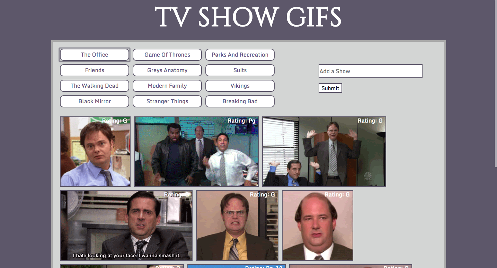

## GIFs_TV_Shows
Description: This app displays gifs for various TV shows, plays them, and allows the user to add more.  

Directions: When the page loads, there are 12 buttons with TV Show names on them. Select a button to display 10 gifs from that show. Select an individual gif to animated it or to stop the animation. You can also search and add another TV Show as a button using the search bar. Type a show name in and click on the submit button, the show will be added as a button and can then be selected to display the relative gifs.

Code: There are three distinct functions making the page work:
    1. The first is a function that makes a button for each TV show listed in the TV Show Array and displays it on the page.
    2. The second function populates the gifs after a TV Show button is selected and lets the user animate and stop each gif.
    3. The third function allows for the user to add more TV Shows. This function calls on the first function to create a new button.

______________
______________
______________
## Visit the deployed version of Nomad-Travelr
[GIFs TV Shows](https://oserenchenko.github.io/GIFs_TV_Shows/)


______________
______________
______________

## Getting Started
to install locally run this command in your terminal
```
git clone https://github.com/oserenchenko/GIFs_TV_Shows.git
```
once inside the GIFs_TV_Shows folder, open the index.html file in your preferred web browser.

## Built With
* HTML - website structure
* [CSS](https://css-tricks.com/) - styling
* [Bootstrap](https://getbootstrap.com/) - styling framework
* [Javascript](https://www.javascript.com/) - website logic
* [jQuery](https://jquery.com/) - manipulating the DOM
* [Giphy API](https://developers.giphy.com/) - source of GIFs

______________
______________
______________
## Authors
* [Olga Serenchenko](https://github.com/oserenchenko)

______________
______________
______________
## License

This project is licensed under the MIT License - see the [LICENSE.md](LICENSE.md) file for details
